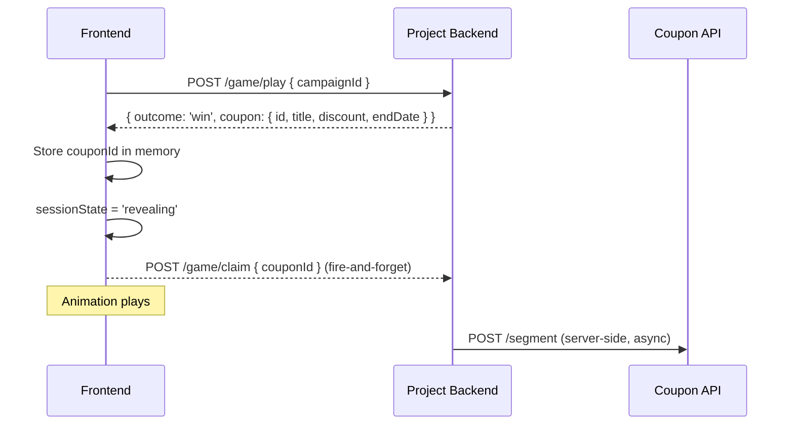
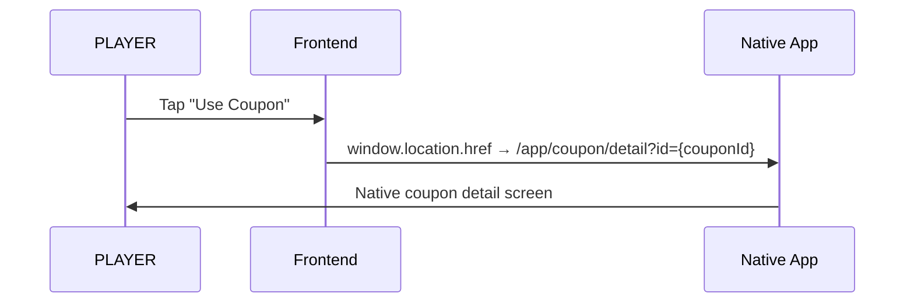
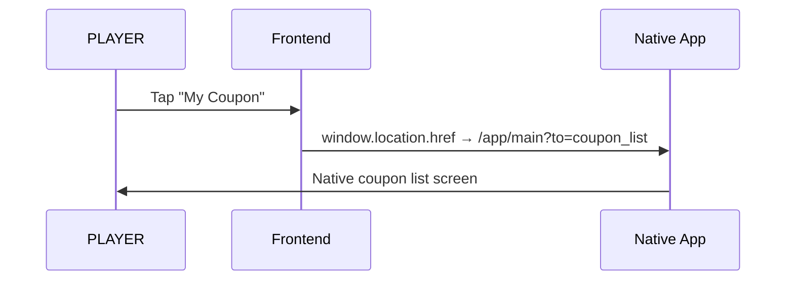

# End-to-End Workflow: Reward Claim Flow

## 1. Purpose & Scope

This workflow describes the complete lifecycle from a winning `play()` result to the player landing on a native coupon screen. It covers the automatic background claim, the persistent win result screen, and the two AppLink navigation paths.

**Starts at:** The `play()` API response is received with `outcome: 'win'`.
**Ends at:** The player has tapped a CTA and been handed off to the native app via AppLink.

**Out of scope:** Authentication (E1), game animation (F2.2), session eligibility and play limits (E4), backend coupon issuance internals, native app behavior after AppLink interception.

## 2. Actors & System Surfaces

| Actor / Role | System Surface | Responsibilities |
|---|---|---|
| **PLAYER** | Win result screen (WebView) | Views win confirmation and coupon preview; chooses "Use Coupon" or "My Coupon" |
| **Frontend (WebView)** | `useGameSession` hook + `GameResult` component | Fires background claim; holds `couponId` in memory; renders win screen; navigates via AppLink |
| **SYSTEM (Project Backend)** | `POST /game/play`, `POST /game/claim` | Returns win result with `couponId`; receives claim request; issues segment coupon via Coupon API |
| **HOST (Native App)** | AppLink interception layer | Intercepts `https://www.skylark.co.jp/app/*` URLs; opens native coupon or coupon-list screen |

## 3. Core Domain Objects & States

### GameSession

| State | Meaning |
|---|---|
| `pending` | Not yet started |
| `initiated` | `play()` API call in flight |
| `revealing` | Win/lose result received; animation in progress; background claim has fired |
| `completed` | Animation complete; result screen visible |

**Business rules:**
- Background claim fires during `revealing` — before the player sees the result screen.
- `couponId` is available in memory from `revealing` state onward.
- The result screen is rendered in `completed` state.

### CouponId

- Received from `play()` response body (`coupon.id`) when `outcome === 'win'`
- Held in memory for the session lifetime
- Never written to any browser storage
- Used for AppLink construction in the "Use Coupon" path

## 4. Workflow Phases

### Phase 1 — Play Result Received

**Trigger:** `POST /game/play` responds with `{ outcome: 'win', coupon: { id, title, discount, endDate } }`

**Frontend actions (synchronous, same async block):**
1. Store `couponId` in memory
2. Set `outcome = 'win'`, `coupon = couponInfo`
3. Set `sessionState = 'revealing'`
4. Fire `POST /game/claim` with `{ couponId }` + `Authorization: Bearer {token}` — **fire-and-forget, no await**

**Player experience:** Game animation plays (scratch reveal or card flip). Player has no awareness of the background claim.



---

### Phase 2 — Win Result Screen Appears

**Trigger:** `handleAnimationComplete()` fires → `sessionState = 'completed'`

**What the player sees:**
- Confetti / celebratory visual
- Win confirmation message
- Coupon preview (title, discount, expiry)
- Points badge (if applicable)
- **"Use Coupon"** button (primary, filled)
- **"My Coupon"** button (secondary, outlined)

**Key invariant:** Both CTAs are enabled immediately. The background claim's in-flight state has no effect on CTA availability. The screen does not auto-navigate under any condition.

---

### Phase 3a — Player taps "Use Coupon"

**Frontend action:** `window.location.href = '${COUPON_BASE_URL}/app/coupon/detail?id={encodedCouponId}'`

**No API call is made.**

**Native app action:** Intercepts AppLink → opens coupon detail screen for the specific coupon.



---

### Phase 3b — Player taps "My Coupon"

**Frontend action:** `window.location.href = '${COUPON_BASE_URL}/app/main?to=coupon_list'`

**No API call is made. No `couponId` needed.**

**Native app action:** Intercepts AppLink → opens the coupon list screen.



---

### Phase 4 — Background Claim Settles (invisible)

The `POST /game/claim` response arrives at some point after Phase 1. The frontend ignores both success and error responses — `.catch(() => {})`. No UI change occurs. The player may already be in the native app by this point.

**If claim succeeds:** Backend has issued the coupon. Player can see it in the native coupon list.
**If claim fails:** Error is discarded. The player still sees the win screen and can navigate — but may not find the coupon in their list yet (backend retry or recovery is a backend concern).

---

## 5. Implementation Checklist

### Frontend (completed ✅)

**Win screen & claim**
- [x] `ENDPOINT.game.claim` added to `src/config/endpoint.ts`
- [x] `GameService.claimCoupon(couponId, token)` — skipped (no-op) when `isLocal`; calls game-api in all other envs
- [x] `useGameSession` fires `claimCoupon` fire-and-forget after win result in `handlePlayInitiated`
- [x] `GameResult.tsx` — auto-redirect removed (`AUTO_CLAIM_DELAY_MS` deleted), win screen persists
- [x] `GameResult.tsx` win screen renders two CTAs ("Use Coupon" / "My Coupon")
  - "Use Coupon" → `/app/coupon/detail?id={encodedCouponId}`
  - "My Coupon" → `/app/main?to=coupon_list`
- [x] i18n keys `result.useCoupon` and `result.myCoupon` added to `en/game.json` and `ja/game.json`
- [x] SCSS `.game-result-cta-group` flex layout added in `_game.scss`

**Environment model (`VITE_DEMO_MODE` → `VITE_ENV`)**
- [x] `VITE_DEMO_MODE`, `VITE_GAME_VARIANT`, `VITE_CAMPAIGN_ID` removed from `vite-env.d.ts`
- [x] `VITE_ENV: string` added to `vite-env.d.ts`
- [x] `environment.isLocal` derived from `VITE_ENV === 'local'` in `environment.ts`
- [x] `game.config.ts` deleted — variant and campaignId come from game-api's `GET /game/config`
- [x] All mock paths removed from `game.service.ts` — service always calls real game-api
- [x] `AuthBridgeService.validate()` — uses `environment.isLocal` instead of `VITE_DEMO_MODE`
- [x] `useAuthBridge` — `VITE_ENV=local` bypasses token collection and validates immediately with `local-dev-token`
- [x] `useAuthBridge` — `local-dev-token` is NOT saved to localStorage (prevents stale token when switching envs)
- [x] CLAUDE.md updated — `VITE_ENV` model documented, `VITE_DEMO_MODE` references removed

**Config (manual step)**
- [ ] Update `.env` file: remove `VITE_DEMO_MODE`, `VITE_GAME_VARIANT`, `VITE_CAMPAIGN_ID`; add `VITE_ENV=local`
  ```
  VITE_ENV=local
  VITE_API_BASE_URL=http://localhost:3000
  VITE_SKYLARK_BASE_URL=https://www.skylark.co.jp
  ```

### Frontend (remaining ⬜)

- [ ] Smoke test (`VITE_ENV=local`): app loads without URL token, auth passes automatically, no 5s wait
- [ ] Smoke test (`VITE_ENV=local`): win result → `POST /game/claim` fires to game-api with `local-dev-token`
- [ ] Smoke test (`VITE_ENV=local`): `local-dev-token` absent from localStorage after auth
- [ ] Smoke test: win screen appears immediately with no loading state, no auto-redirect
- [ ] Smoke test: "Use Coupon" navigates to `/app/coupon/detail?id={couponId}` with no prior API call
- [ ] Smoke test: "My Coupon" navigates to `/app/main?to=coupon_list` with no API call

### Backend (completed ✅)

- [x] `POST /game/claim` endpoint implemented
  - Accepts `{ couponId }` in body
  - Requires `Authorization: Bearer <jwt>` header
  - Validates that the `couponId` matches an active winning session for the authenticated player
  - Calls `POST /segment` on the Coupon API server-side
  - Idempotent: returns 200 even if the coupon was already issued for this session (`claimed_at` column)
- [x] `POST /game/play` response includes `coupon.id` in win result — Coupon API call moved to `/game/claim`; `play()` records the selected coupon and returns its ID
- [x] Backend error responses for `/game/claim`: 401 (invalid token), 409 (couponId mismatch), 500/503 (transient — discarded by frontend)
- [x] Migration `20260806200001_add_claimed_at_to_game_sessions.js` adds `claimed_at` column for idempotency tracking
- [ ] Run `pnpm run migrate` to apply the `claimed_at` migration on each environment

### QA / Acceptance ⬜

- [ ] AC-311: Background claim fires without player action (network tab confirms `POST /game/claim`)
- [ ] AC-312: Win screen appears with no loading state
- [ ] AC-232: "Use Coupon" navigates to `/app/coupon/detail?id=...` with no API call
- [ ] AC-233: "My Coupon" navigates to `/app/main?to=coupon_list` with no API call
- [ ] AC-234: Win screen persists — no auto-redirect after 3s, 10s, or any delay
- [ ] AC-235: CTAs are enabled while claim is in flight
- [ ] AC-313: Background claim 500 → win screen unchanged
- [ ] Locale: "クーポンを使う" / "クーポンを確認する" on `ja`
- [ ] iOS + Android AppLink interception verified for both paths
